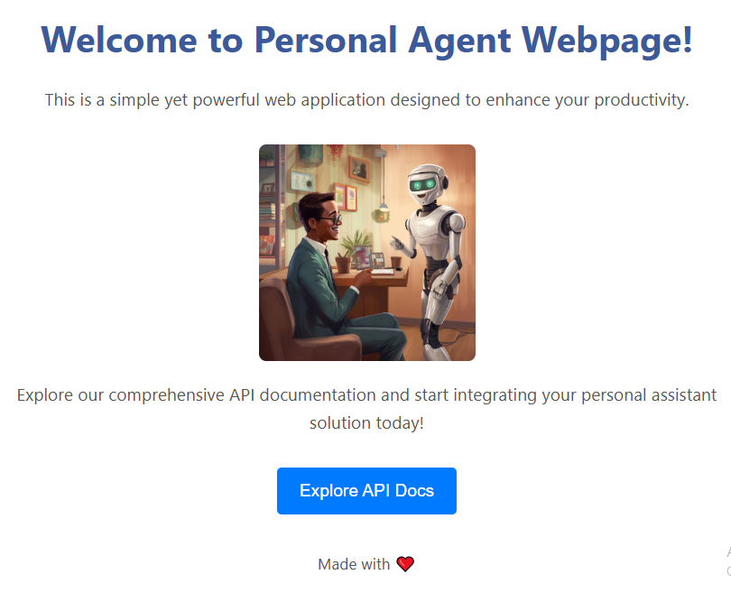

### Project Scope: 
Idea is to build a solution around personal agent

This application looks like



**Local Setup steps**
- create and activate virtual environment: 
```bash
source personal_agent_venv/bin/activate
```
- install requirements.txt
```bash
pip install -r requirements.txt
```
- run app:
```bash
uvicorn app:app --port 8080
```

To run model locally on Ollama
- Go to new terminal
- Activate personal_agent_venv
- Run following command
```
ollama run smollm:135m
```

